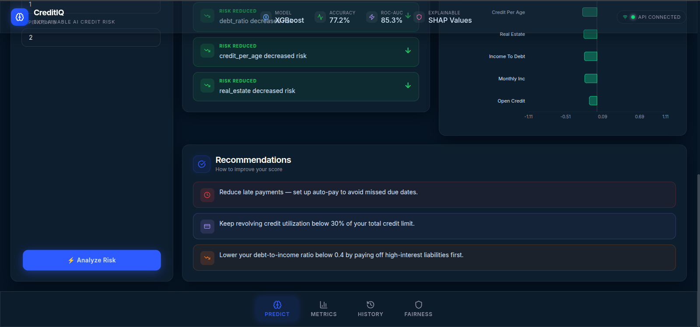
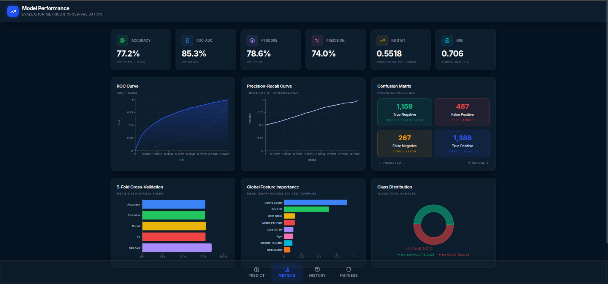
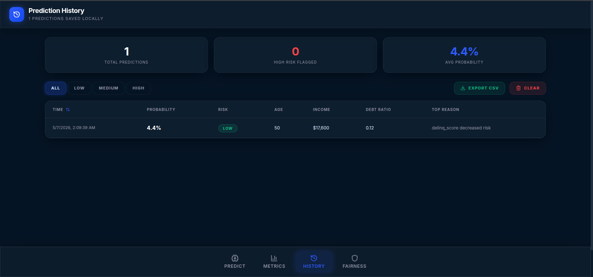
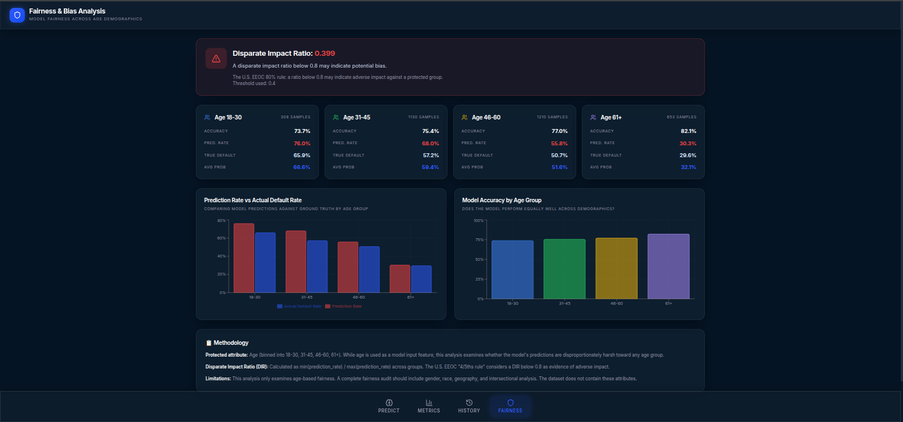

# CreditIQ — Explainable Credit Risk Prediction

A full stack AI project that predicts loan applicant risk and actually explains why. Built on XGBoost with SHAP for feature attribution, so you can see which financial factors pushed a score up or down — not just the number.

We built this for our B.Tech research project (BTP2CSE179). The core problem was straightforward: credit scoring models are black boxes, and that's a real issue when someone's loan gets denied. We wanted a system that gives a prediction *and* a human-readable reason for it, with a fairness check on top.

## Screenshots

The dashboard runs locally on `localhost:3000`. Here is what each page looks like:

### Landing Page

The main entry point. Input the applicant's financial profile and get an instant risk prediction with a visual gauge.


### Key Factors (SHAP Explanation)

The SHAP waterfall chart shows exactly which features pushed the risk score up or down for that specific prediction. No black box.


### Recommendations

Based on the risk factors, the app suggests what the applicant could change to improve their score.



### Model Performance

ROC curves, confusion matrix, and cross-validation results. All the metrics in one place.



### Prediction History

Every prediction made in the session, stored locally so you can compare applicants side by side.



### Fairness & Bias Analysis

Checks the disparate impact ratio across age demographics to flag whether the model treats groups differently.



## What it does

The model takes standard loan application data (income, debt, credit history, employment length, etc.) and outputs a three-tier risk classification: low, medium, or high. That part is fairly routine. The interesting piece is everything after the prediction:

- SHAP values show the exact contribution of each feature to that specific score
- A what-if slider panel lets you tweak inputs and watch the risk change in real time
- The fairness module runs a disparate impact check across age groups to catch demographic bias
- Prediction history lets you compare multiple applicants in a session

The backend validates inputs through Pydantic, runs a preprocessing pipeline with log transforms and derived ratios, then passes the cleaned data to the XGBoost model and SHAP TreeExplainer together.

## Model performance

Evaluated with 5-fold stratified cross-validation:

| Metric | Score |
|--------|-------|
| Accuracy | 0.7716 |
| Precision | 0.7403 |
| Recall | 0.8387 |
| F1 Score | 0.7864 |
| ROC-AUC | 0.8530 |

Recall is higher than precision by design — in credit risk, missing a high-risk applicant (false negative) costs more than a false positive.

## Tech stack

- **Backend:** Python, FastAPI, Pydantic, XGBoost, SHAP, Scikit-learn
- **Frontend:** React 19, React Router, Tailwind CSS, Recharts
- **Deployment:** Docker, Docker Compose

## Running it locally

You need Python 3.10+ and Node.js 18+.

**Backend:**
```bash
cd backend
pip install -r ../requirements.txt
python -m uvicorn app:app --reload
```
The API starts on `http://localhost:8000`.

**Frontend:**
```bash
cd frontend
npm install
npm run dev
```
The dashboard opens at `http://localhost:3000`.

**Docker (both at once):**
```bash
docker compose up --build
```

## API endpoints

- `GET /health` — API status and model version
- `POST /predict` — Takes an applicant profile, returns risk classification and SHAP values
- `GET /metrics` — ROC curve, confusion matrix, and cross-validation results
- `GET /global-shap` — Feature importance across the full test set
- `GET /fairness` — Age-based disparate impact analysis
- `POST /predict/batch` — Batch predictions from a CSV upload

## Project structure

```
.
├── backend/
│   └── app.py                 # FastAPI server
├── frontend/
│   ├── src/                   # React components and pages
│   └── public/                # Static assets
├── model/                     # Preprocessing pipeline and training scripts
├── artifacts/                 # Saved model, SHAP explainer, evaluation metrics
├── data/                      # Credit risk benchmark dataset
└── screenshots/               # Dashboard screenshots
```
B.Tech Computer Science and Engineering, 4th Semester, 2025–2026